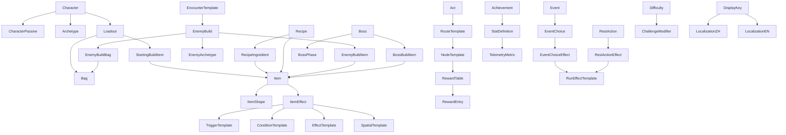

# 配置关系图

```mermaid
graph TD
  Character --> CharacterPassive
  Character --> Archetype
  Character --> Loadout
  Loadout --> StartingBuildItem
  Loadout --> Bag
  StartingBuildItem --> Item
  Item --> ItemShape
  Item --> ItemEffect
  ItemEffect --> TriggerTemplate
  ItemEffect --> ConditionTemplate
  ItemEffect --> EffectTemplate
  ItemEffect --> SpatialTemplate
  Recipe --> RecipeIngredient
  RecipeIngredient --> Item
  Recipe --> Item
  Act --> RouteTemplate
  RouteTemplate --> NodeTemplate
  NodeTemplate --> RewardTable
  EncounterTemplate --> EnemyBuild
  EnemyBuild --> EnemyArchetype
  EnemyBuild --> EnemyBuildBag
  EnemyBuild --> EnemyBuildItem
  EnemyBuildBag --> Bag
  EnemyBuildItem --> Item
  Boss --> BossPhase
  Boss --> BossBuildItem
  BossBuildItem --> Item
  RewardTable --> RewardEntry
  Event --> EventChoice
  EventChoice --> EventChoiceEffect
  EventChoiceEffect --> RunEffectTemplate
  RestAction --> RestActionEffect
  RestActionEffect --> RunEffectTemplate
  Achievement --> StatDefinition
  StatDefinition --> TelemetryMetric
  Difficulty --> ChallengeModifier
  DisplayKey --> LocalizationZH
  DisplayKey --> LocalizationEN
```

所有带 `name_key`、`title_key`、`description_key` 或 `body_key` 的记录都依赖两张本地化表。运行时业务数据只保存稳定 ID。
